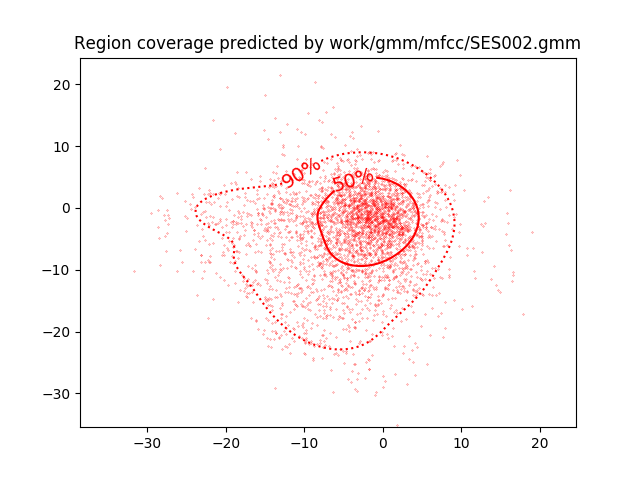

PAV - P4: reconocimiento y verificación del locutor
===================================================

Obtenga su copia del repositorio de la práctica accediendo a [Práctica 4](https://github.com/albino-pav/P4)
y pulsando sobre el botón `Fork` situado en la esquina superior derecha. A continuación, siga las
instrucciones de la [Práctica 2](https://github.com/albino-pav/P2) para crear una rama con el apellido de
los integrantes del grupo de prácticas, dar de alta al resto de integrantes como colaboradores del proyecto
y crear la copias locales del repositorio.

También debe descomprimir, en el directorio `PAV/P4`, el fichero [db_8mu.tgz](https://atenea.upc.edu/pluginfile.php/3145524/mod_assign/introattachment/0/spk_8mu.tgz?forcedownload=1)
con la base de datos oral que se utilizará en la parte experimental de la práctica.

Como entrega deberá realizar un *pull request* con el contenido de su copia del repositorio. Recuerde
que los ficheros entregados deberán estar en condiciones de ser ejecutados con sólo ejecutar:

~~~~~~~~~~~~~~~~~~~~~~~~~~~~~~~~~~~~~~~~~~~~~~~~~~~~~.sh
  make release
  run_spkid mfcc train test classerr verify verifyerr
~~~~~~~~~~~~~~~~~~~~~~~~~~~~~~~~~~~~~~~~~~~~~~~~~~~~~

Recuerde que, además de los trabajos indicados en esta parte básica, también deberá realizar un proyecto
de ampliación, del cual deberá subir una memoria explicativa a Atenea y los ficheros correspondientes al
repositorio de la práctica.

A modo de memoria de la parte básica, complete, en este mismo documento y usando el formato *markdown*, los
ejercicios indicados.

## Ejercicios.

### SPTK, Sox y los scripts de extracción de características.

- Analice el script `wav2lp.sh` y explique la misión de los distintos comandos, y sus opciones, involucrados
  en el *pipeline* principal (`sox`, `$X2X`, `$FRAME`, `$WINDOW` y `$LPC`).
  
  La línea del código que tenemos es la siguiente:  
  sox $inputfile -t raw -e signed -b 16 - | $X2X +sf | $FRAME -l 240 -p 80 | $WINDOW -l 240 -L 240 | $LPC -l 240 -m $lpc_order > $base.lp
  
  **sox** - Es la abreviatura de Sound eXchange. Este comando se utiliza para manipular archivos de audio. Nos permite leer y escribir archivos con formato AU, WAV, MP3, entre otros. En el caso concreto de nuestra práctica, nos permite leer el archivo que queremos analizar (inputfile).  
       Con "-t" indicamos el tipo de formato que queremos en el fichero de salida, en este caso, queremos un fichero sin cabecera (raw).  
       Con "-e" indicamos cual será el tipo de datos a los que convertirá la señal de entrada. En nuestro caso a datos de tipo signed.  
       Con "-b" indicamos el número de bits que tendran los datos a la salida. En nuestro caso 16 bits.  
       Con "-" indicamos que el resultado se debe escribir en la salida estándar.
  
  **$X2X** - El programa x2x permite la conversión entre distintos formatos de datos. Soporta múltiples tipos de datos como "-c" (char), "-s" (short), "-i" (int), "-l" (long) los cuales se definen en las opciones "+type1" y "+type2". En nuestro caso usamos "+sf" que corresponde a short (type1) float (type2). Dispone de otras opciones como "%format" (especifica el formato de la salida si el tipo 2 es ascii), "-r" (hace un redondeo del valor cuando un número real se sustituye por un entero) y "-o" (si los datos de la señal de entrada estan fuera del rango de los datos de salida, se recortan los de salida). Las dos últimas tienen false como valor por defecto.
  
  **$FRAME** - A partir de la señal que se ha obtenido a la entrada, el programa frame genera una señal a la salida  dividida en tramas de l muestras tomadas con un desplazamiento de p muestras. En nuestro caso, las tramas seran de 240 muestras desplazadas 80 muestras. También permite el uso de otras opciones como "-n" (para centrar. Es false por defecto).
  
  **$WINDOW** - Nos permite hacer un enventanado para cada una de las tramas. Este programa presenta diferentes opciones: "-l" (longitud de la trama de entrada), "-L" (longitud de la trama de salida),  "-n" (tipo de normalización, por ejemplo, por la potencia), "-w" (tipo de ventana que se utiliza. Por defecto utiliza Blackman, aunque se pueden utilizar Hamming, Hanning, Bartlett, Rectangular, etc...)
  
  **$LPC** - Este programa hace un analisis LPC siguiendo el método de Levinson-Durbin. Las opciones que permite són "-l" (longitud de la trama), "-m" (orden del LPC) i "-f" (define el valor mínimo del determinante de la matriz normalizada).
  
  Todos los programas incluyen también la opción "-h" la cual permité mostrar el mensaje de ayuda de cada uno de los programas.

- Explique el procedimiento seguido para obtener un fichero de formato *fmatrix* a partir de los ficheros de salida de SPTK (líneas 41 a 47 del script `wav2lp.sh`).
  
  Las líneas del código són las siguientes:
  
  #Main command for feature extration  
  sox $inputfile -t raw -e signed -b 16 - | $X2X +sf | $FRAME -l 240 -p 80 | $WINDOW -l   240 -L 240 | $LPC -l 240 -m $lpc_order > $base.lp

  #Our array files need a header with the number of cols and rows:  
  ncol=$((lpc_order+1)) # lpc p =>  (gain a1 a2 ... ap)  
  nrow=`$X2X +fa < $base.lp | wc -l | perl -ne 'print $_/'$ncol', "\n";'`

  La primera pipeline hace las siguientes tareas:  
       - Convierte la señal de entrada a reales de coma flotantes (programa x2x con opción +sf) de 16 bits (programa sox con opción -b 16) y escribe el resultado en la salida estándar.  
       - Divide la señal de entrada en tramas de 240 muestras (programa frame con opción -l 240) con desplazamiento de ventana de 80 muestras (programa frame con opción -p 80).  
       - Multiplica cada trama por la ventana Blackman (programa window con opción sin especificar, ya que se usa la que hay por defecto). El tamaño de las tramas de entrada y salida es de 240 (programa window con opción -l 240 (entrada) -L 240 (salida).  
       - Calcula los lpc_order primeros coeficientes de lp (programa lpc con opción -m $lpc_order).  
       - Se redirecciona el resultado de la pipeline al fichero base.lp (con los comandos > $base.lp).
       
  La segunda pipeline hace las siguientes tareas:  
       - Se definen el número de columnas que coincide con el número de coeficientes. Como en el primer elemento del predictor se almacena la ganancia de predicción, tendremos $lpc_order + 1 columnas.  
       - Se definen el número de filas que coincide con el número de tramas. Para obtenerlo convertimos la señal a texto (utilizamos sox +fa) y contamos el número de lineas (utilizamos wc -l).  
       - Se divide el número de valores almacenados en el fichero por el número de coeficientes de cada trama de señal (utilizamos -perl)

  * ¿Por qué es conveniente usar este formato (u otro parecido)?
  
  En este formato, los datos se almacenan en filas y columnas. Cada fila corresponde a una trama de la señal, y cada columna a cada uno de los coeficientes con los que se parametriza la trama. Esta distribución de la información, nos permite acceder muy facilmente a valores concretos de interés, como pueden ser una trama en concreto, el valor de una trama para un coeficiente concreto, etc...  

- Escriba el *pipeline* principal usado para calcular los coeficientes cepstrales de predicción lineal
  (LPCC) en su fichero <code>scripts/wav2lpcc.sh</code>:
  
  sox $inputfile -t raw -e signed -b 16 - | $X2X +sf | $FRAME -l 240 -p 80 | $WINDOW -l 240 -L 240 | $LPC -l 240 -m $lpc_order | $LPC2C -m $lpc_order -M 25 > $base.lp

- Escriba el *pipeline* principal usado para calcular los coeficientes cepstrales en escala Mel (MFCC) en
  su fichero <code>scripts/wav2mfcc.sh</code>:
  
  sox $inputfile -t raw -e signed -b 16 - | $X2X +sf | $FRAME -l 240 -p 80 | $WINDOW -l 240 -L 240 | $MFCC -l 240 -m $mfcc_order -s 8 -n 40 > $base.lp

### Extracción de características.

- Inserte una imagen mostrando la dependencia entre los coeficientes 2 y 3 de las tres parametrizaciones
  para una señal de prueba.
  
  + ¿Cuál de ellas le parece que contiene más información?

- Usando el programa <code>pearson</code>, obtenga los coeficientes de correlación normalizada entre los
  parámetros 2 y 3, y rellene la tabla siguiente con los valores obtenidos.

  |                        | LP   | LPCC | MFCC |
  |------------------------|:----:|:----:|:----:|
  | &rho;x[2,3] |      |      |      |
  
  + Compare los resultados de <code>pearson</code> con los obtenidos gráficamente.
  
- Según la teoría, ¿qué parámetros considera adecuados para el cálculo de los coeficientes LPCC y MFCC?

### Entrenamiento y visualización de los GMM.

Complete el código necesario para entrenar modelos GMM.

- Inserte una gráfica que muestre la función de densidad de probabilidad modelada por el GMM de un locutor
  para sus dos primeros coeficientes de MFCC.
  
  En esta primera gráfica podemos ver la densidad de probabilidad modelada por el GMM del locutor 002 sin incluir las poblaciones:
  
  
    
  En esta segunda gráfica, se inluyen también las poblaciones:
  
  

- Inserte una gráfica que permita comparar los modelos y poblaciones de dos locutores distintos (la gŕafica
  de la página 20 del enunciado puede servirle de referencia del resultado deseado). Analice la capacidad
  del modelado GMM para diferenciar las señales de uno y otro.
  
  A continuación podemos ver la comparativa utilizando los modelos y loctuores 002 y 200:
  
  
  

### Reconocimiento del locutor.

Complete el código necesario para realizar reconociminto del locutor y optimice sus parámetros.

- Inserte una tabla con la tasa de error obtenida en el reconocimiento de los locutores de la base de datos
  SPEECON usando su mejor sistema de reconocimiento para los parámetros LP, LPCC y MFCC.

### Verificación del locutor.

Complete el código necesario para realizar verificación del locutor y optimice sus parámetros.

- Inserte una tabla con el *score* obtenido con su mejor sistema de verificación del locutor en la tarea
  de verificación de SPEECON. La tabla debe incluir el umbral óptimo, el número de falsas alarmas y de
  pérdidas, y el score obtenido usando la parametrización que mejor resultado le hubiera dado en la tarea
  de reconocimiento.
 
### Test final y trabajo de ampliación.

- Recuerde adjuntar los ficheros `class_test.log` y `verif_test.log` correspondientes a la evaluación
  *ciega* final.

- Recuerde, también, enviar a Atenea un fichero en formato zip o tgz con la memoria con el trabajo
  realizado como ampliación, así como los ficheros `class_ampl.log` y/o `verif_ampl.log`, obtenidos como
  resultado del mismo.
